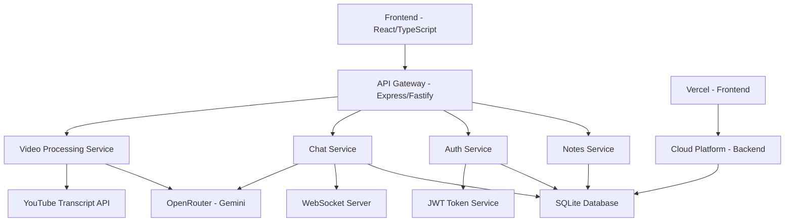

# Design Document

## Overview

The YouTube Video Summarizer is a full-stack web application built with React/TypeScript frontend and Node.js backend, utilizing SQLite for data persistence and OpenRouter's Gemini model for AI-powered summarization. The application follows a modern, component-based architecture with real-time chat capabilities and a glassmorphic UI design.

## Architecture

### System Architecture



### Technology Stack

**Frontend:**
- React 18 with TypeScript for type safety
- Tailwind CSS for styling with custom design tokens
- Framer Motion for animations and transitions
- Zustand for lightweight state management
- React Router for client-side routing
- Radix UI for accessible component primitives
- React Hook Form + Zod for form validation

**Backend:**
- Node.js with Express/Fastify framework
- WebSocket support for real-time chat
- Prisma ORM for database operations
- JWT for authentication
- youtube-transcript package for video processing

**Database:**
- SQLite for lightweight, file-based persistence
- Prisma schema for type-safe database operations

**External Services:**
- OpenRouter API with Gemini model for AI processing
- YouTube API for video metadata

## Components and Interfaces

### Frontend Components

#### Core Layout Components
```typescript
// Navigation Component
interface NavBarProps {
  user: User | null;
  currentPath: string;
}

// Main Layout
interface LayoutProps {
  children: React.ReactNode;
  showSidebar?: boolean;
}
```

#### Video Processing Components
```typescript
// Video Input Card
interface VideoInputCardProps {
  onSubmit: (url: string) => Promise<void>;
  isLoading: boolean;
  error: string | null;
}

// Processing Status
interface ProcessingStatusProps {
  status: 'idle' | 'processing' | 'success' | 'error';
  progress?: number;
  message?: string;
}
```

#### Notes Management Components
```typescript
// Note Card
interface NoteCardProps {
  note: Note;
  onView: (noteId: string) => void;
  onEdit: (noteId: string) => void;
  onDelete: (noteId: string) => void;
  onChat: (noteId: string) => void;
}

// Summary Modal
interface SummaryModalProps {
  note: Note;
  isOpen: boolean;
  onClose: () => void;
  onCopy: () => void;
  onDownloadPDF: () => void;
}
```

#### Chat Components
```typescript
// Chat Interface
interface ChatInterfaceProps {
  noteId: string;
  isOpen: boolean;
  onClose: () => void;
}

// Chat Message
interface ChatMessageProps {
  message: ChatMessage;
  isUser: boolean;
  timestamp: Date;
}

// Suggested Questions
interface SuggestedQuestionsProps {
  questions: string[];
  onQuestionClick: (question: string) => void;
}
```

### Backend API Interfaces

#### Video Processing Service
```typescript
interface VideoProcessingService {
  processVideo(url: string, userId: string): Promise<ProcessedVideo>;
  extractVideoId(url: string): string | null;
  fetchTranscript(videoId: string): Promise<string>;
  chunkTranscript(transcript: string): string[];
  generateSummary(chunks: string[]): Promise<string>;
}

interface ProcessedVideo {
  noteId: string;
  title: string;
  thumbnail: string;
  duration: number;
  summary: string;
  sections: SummarySection[];
}
```

#### Chat Service
```typescript
interface ChatService {
  sendMessage(noteId: string, userId: string, message: string): Promise<ChatResponse>;
  getChatHistory(noteId: string, userId: string): Promise<ChatMessage[]>;
  buildContext(note: Note, previousMessages: ChatMessage[]): ChatContext;
}

interface ChatResponse {
  response: string;
  sources: string[];
  timestamp: Date;
}
```

#### Notes Service
```typescript
interface NotesService {
  getUserNotes(userId: string): Promise<Note[]>;
  getNote(noteId: string, userId: string): Promise<Note>;
  updateNote(noteId: string, userId: string, updates: Partial<Note>): Promise<Note>;
  deleteNote(noteId: string, userId: string): Promise<void>;
}
```

## Data Models

### Database Schema (Prisma)

```prisma
model User {
  id        String   @id @default(cuid())
  email     String   @unique
  name      String?
  password  String
  createdAt DateTime @default(now())
  notes     Note[]
  chats     Chat[]
}

model Note {
  id           String   @id @default(cuid())
  userId       String
  videoUrl     String
  videoId      String
  title        String
  thumbnail    String
  duration     Int
  transcript   String   @db.Text
  summary      String   @db.Text
  sections     Json
  createdAt    DateTime @default(now())
  updatedAt    DateTime @updatedAt
  user         User     @relation(fields: [userId], references: [id])
  chats        Chat[]
}

model Chat {
  id        String   @id @default(cuid())
  userId    String
  noteId    String
  messages  Json
  createdAt DateTime @default(now())
  updatedAt DateTime @updatedAt
  user      User     @relation(fields: [userId], references: [id])
  note      Note     @relation(fields: [noteId], references: [id])
}
```

### Frontend State Models

```typescript
// Zustand Store Interfaces
interface AppState {
  user: User | null;
  notes: Note[];
  currentNote: Note | null;
  chatSessions: Record<string, ChatSession>;
  ui: UIState;
}

interface UIState {
  isLoading: boolean;
  error: string | null;
  modals: {
    summary: boolean;
    chat: boolean;
  };
  theme: 'dark' | 'light';
}

interface ChatSession {
  noteId: string;
  messages: ChatMessage[];
  isLoading: boolean;
  suggestedQuestions: string[];
}
```

## Error Handling

### Frontend Error Boundaries
```typescript
// Global Error Boundary
interface ErrorBoundaryState {
  hasError: boolean;
  error: Error | null;
}

// API Error Handling
interface APIError {
  status: number;
  message: string;
  code: string;
}

// Error Toast System
interface ErrorToastProps {
  error: APIError;
  onDismiss: () => void;
}
```

### Backend Error Handling
```typescript
// Custom Error Classes
class VideoProcessingError extends Error {
  constructor(message: string, public code: string) {
    super(message);
  }
}

class TranscriptNotFoundError extends VideoProcessingError {
  constructor(videoId: string) {
    super(`Transcript not found for video: ${videoId}`, 'TRANSCRIPT_NOT_FOUND');
  }
}

// Error Middleware
interface ErrorResponse {
  error: {
    message: string;
    code: string;
    details?: any;
  };
}
```

### Error Recovery Strategies
1. **Network Errors**: Implement retry logic with exponential backoff
2. **API Rate Limits**: Queue requests and implement rate limiting
3. **Transcript Failures**: Fallback to manual transcript upload
4. **AI Service Errors**: Provide cached responses or simplified summaries
5. **Database Errors**: Implement connection pooling and retry mechanisms

## Testing Strategy

### Frontend Testing
```typescript
// Component Testing with React Testing Library
describe('VideoInputCard', () => {
  it('should validate YouTube URLs correctly', () => {
    // Test URL validation logic
  });
  
  it('should show loading state during processing', () => {
    // Test loading states
  });
  
  it('should display error messages for invalid URLs', () => {
    // Test error handling
  });
});

// Integration Testing
describe('Video Processing Flow', () => {
  it('should complete full video processing workflow', () => {
    // Test end-to-end video processing
  });
});
```

### Backend Testing
```typescript
// Unit Testing for Services
describe('VideoProcessingService', () => {
  it('should extract video ID from YouTube URL', () => {
    // Test video ID extraction
  });
  
  it('should chunk transcript correctly', () => {
    // Test transcript chunking logic
  });
  
  it('should handle API failures gracefully', () => {
    // Test error handling
  });
});

// API Integration Testing
describe('Video Processing API', () => {
  it('should process video and return summary', async () => {
    // Test full API workflow
  });
});
```

### End-to-End Testing
```typescript
// Playwright/Cypress Tests
describe('User Workflow', () => {
  it('should allow user to process video and chat', () => {
    // Test complete user journey
  });
});
```

### Performance Testing
1. **Load Testing**: Test concurrent video processing
2. **Database Performance**: Test query performance with large datasets
3. **Memory Usage**: Monitor memory consumption during transcript processing
4. **API Response Times**: Ensure sub-second response times for chat

### Security Testing
1. **Authentication**: Test JWT token validation
2. **Authorization**: Verify user data isolation
3. **Input Validation**: Test against malicious inputs
4. **Rate Limiting**: Test API rate limiting effectiveness

## Design Decisions and Rationales

### Technology Choices

**SQLite over PostgreSQL/MySQL:**
- Simplified deployment and maintenance
- File-based storage suitable for moderate scale
- Excellent performance for read-heavy workloads
- Easy backup and migration

**Zustand over Redux:**
- Minimal boilerplate
- TypeScript-first design
- Smaller bundle size
- Simpler learning curve

**Tailwind CSS over Styled Components:**
- Utility-first approach for rapid development
- Consistent design system
- Better performance (no runtime CSS-in-JS)
- Easier maintenance

**OpenRouter over Direct OpenAI:**
- Model flexibility and fallback options
- Cost optimization
- Better rate limiting handling
- Access to multiple AI providers

### Architecture Decisions

**Monolithic Backend:**
- Simpler deployment and debugging
- Reduced complexity for initial version
- Easier data consistency
- Lower operational overhead

**WebSocket for Chat:**
- Real-time user experience
- Efficient for frequent message exchanges
- Better than polling for chat applications
- Supports future features like typing indicators

**Client-Side Routing:**
- Better user experience with instant navigation
- Reduced server load
- Easier state management
- SEO considerations handled by meta tags